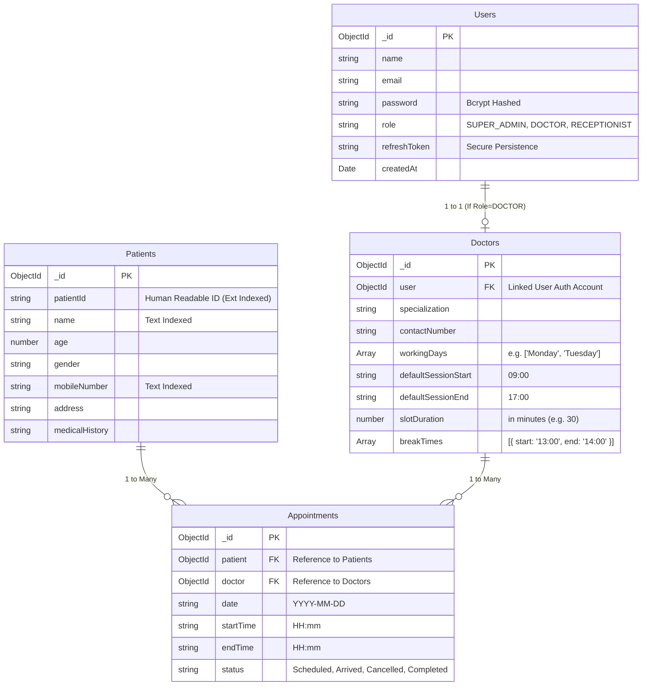

# Database Schema & Entity Relationships

The EMR system utilizes a normalized NoSQL (MongoDB) mapping structure focusing heavily on decoupled references to provide maximum searchability and concurrency scaling.

Below is the visual overview of the Document relationships within the system.

### Key DB Design Principles
1. **Concurrency Protection**: The `Appointments` collection utilizes a rigid native compound index: `appointmentSchema.index({ doctor: 1, date: 1, startTime: 1 }, { unique: true })`. This guarantees that even under extreme sub-millisecond racing conditions, MongoDB natively locks the insertion and throws a `11000` Duplicate error preventing double bookings.
2. **Decoupled Auths**: The auth schema (`Users`) is deliberately snapped apart from the domain application schema (`Doctors`, `Patients`). This prevents heavy auth requests from dragging large arrays of schedule logic into memory unnecessarily.
3. **Optimized Dashboards**: A secondary index on `{ date: 1, status: 1 }` ensures that daily aggregate queries (e.g. Receptionist Dashboard fetching "Today's Status metrics") execute via index scans rather than full collection crawls.
